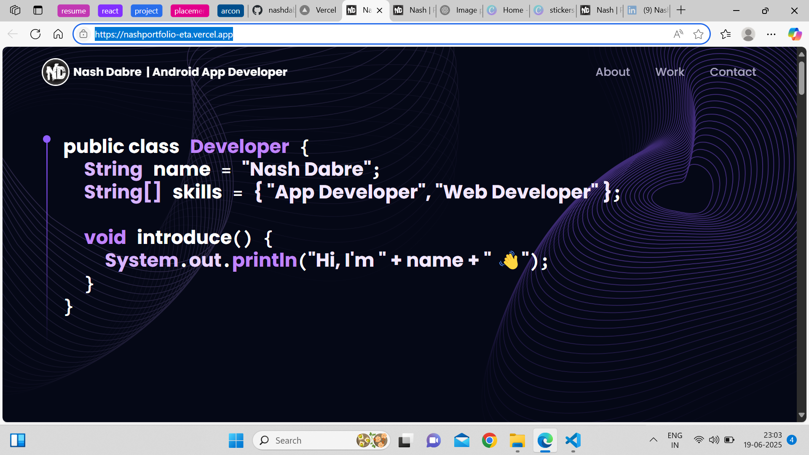
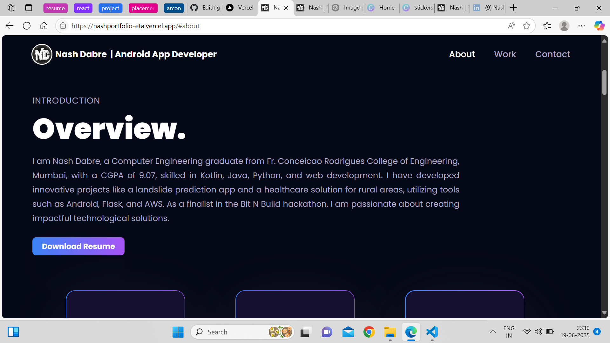
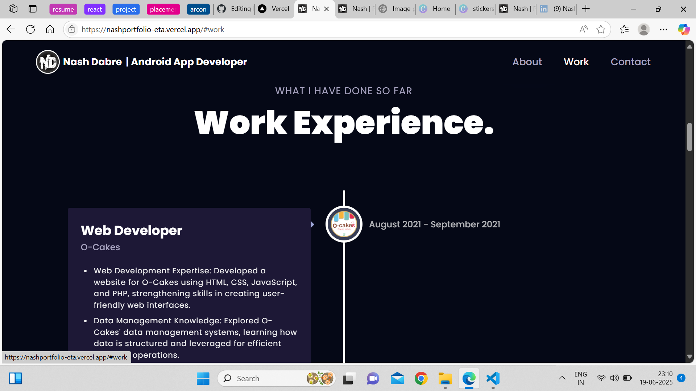
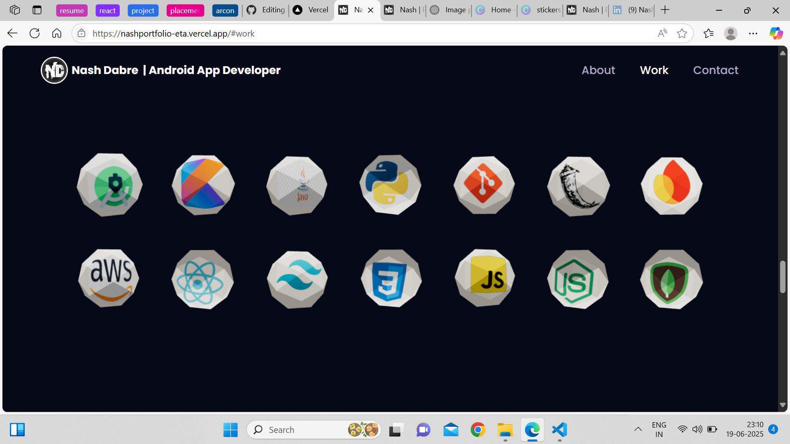
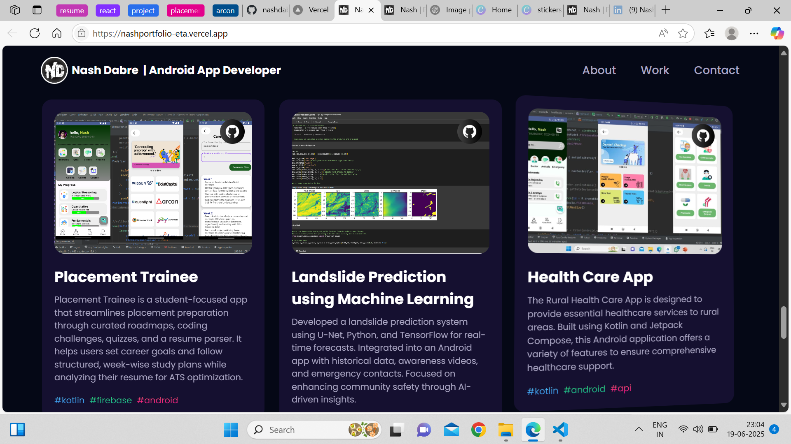
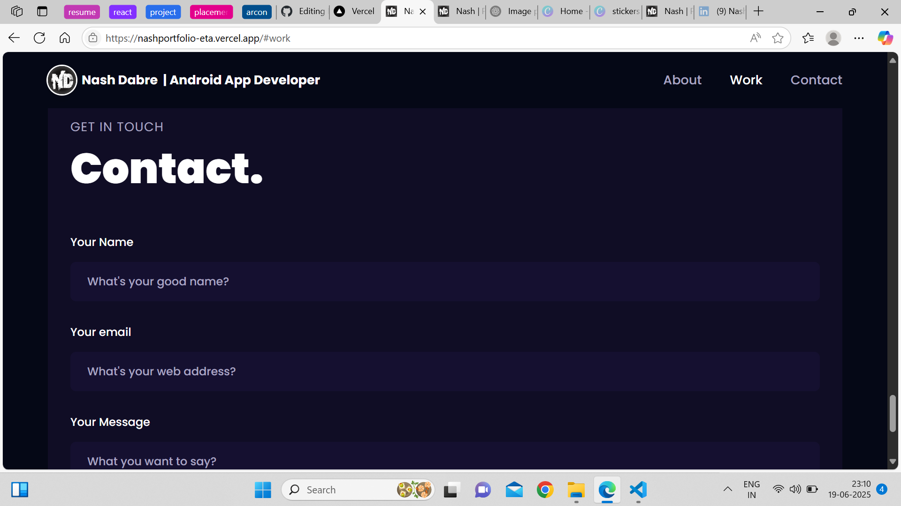

# 🚀 Nash Dabre's Developer Portfolio

Welcome to my personal portfolio website! 👨‍💻  
This site showcases my **skills**, **projects**, and the **technologies** I work with as a Mobile and Web Developer.

## 🌐 Live Demo
> 🔗 [View Portfolio](https://nashportfolio-eta.vercel.app)

---

## 🛠️ Tech Stack

- **Frontend:** React.js, Tailwind CSS, Vite
- **Backend:** Node.js, Express (for contact form)
- **Email Service:** Nodemailer
- **Deployment:** 
  - Frontend hosted on **Vercel**
  - Backend (email server) hosted on **Render**

---

## 📂 Features

- 🎨 Responsive design across all devices
- 📬 Functional contact form (with backend integration)
- 💻 Projects section with GitHub links
- 🚀 Technologies & skills section
- 🧠 Clean, modern UI with interactive animations

---

## 📸 Screenshots

| Home Page | About | Work Experience | Technologis Used | Projects | Contacts |
|----------|----------|----------|----------|----------|----------|
|  |  |  |  |  |  |

> *(Optional: Add images of your deployed site by placing them in a `screenshots/` folder)*

---

## 📬 Contact

Feel free to connect with me via the contact form on the site or through:

- 📧 Email: [nashdabrework@gmail.com](mailto:nashdabrework@gmail.com)
- 💼 [LinkedIn](https://www.linkedin.com/in/nash-dabre-56a3a226a)
- 🧑‍💻 [GitHub](https://github.com/nashdabre)

